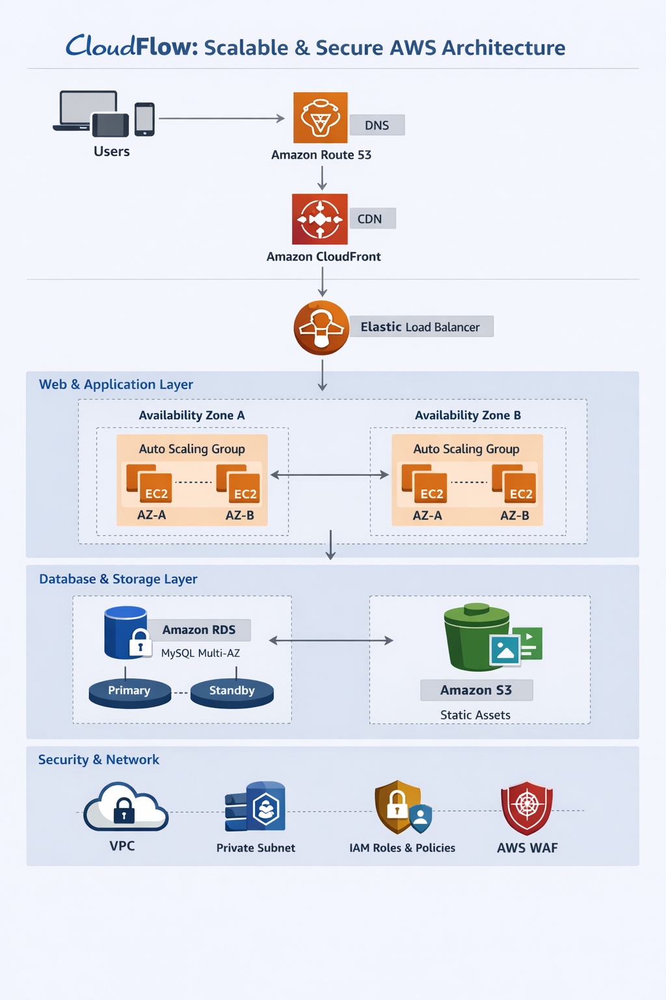

# 🚀 CloudFlow – Scalable & Secure AWS Web Architecture

CloudFlow is a production-ready, scalable, secure, and highly available web application architecture built on Amazon Web Services (AWS).  

This project demonstrates how multiple AWS services work together to create a fault-tolerant and performance-optimized cloud environment.

---

## 📌 Project Objective

The goal of this project is to design and deploy a real-world cloud architecture that:

- Automatically scales based on traffic
- Ensures high availability across Availability Zones
- Implements strong security best practices
- Optimizes performance using CDN
- Reduces cost through efficient resource management

---

# 🏗 Architecture Overview

## 🔷 High-Level Architecture

```
                    Users
                      │
                      ▼
               Route 53 (DNS)
                      │
                      ▼
               CloudFront (CDN)
                      │
                      ▼
        Application Load Balancer (ALB)
                      │
        ┌─────────────┴─────────────┐
        ▼                           ▼
   EC2 (AZ-1)                   EC2 (AZ-2)
        │                           │
        └─────────────┬─────────────┘
                      ▼
              RDS (Multi-AZ)
                      │
                      ▼
                     S3
```

---

# ☁️ AWS Services Used

### 1️⃣ Compute Layer
- EC2 (Ubuntu Server)
- Auto Scaling Group
- Application Load Balancer

### 2️⃣ Database Layer
- RDS (MySQL)
- Multi-AZ deployment
- Automated backups
- Encryption enabled

### 3️⃣ Storage Layer
- S3 for static assets (HTML, CSS, JS, Images)
- Versioning enabled
- Server-side encryption (AES-256)

### 4️⃣ Content Delivery
- CloudFront for global caching
- HTTPS enforced

### 5️⃣ DNS Management
- Route 53 for custom domain routing

### 6️⃣ Networking
- VPC
- Public and Private Subnets
- Security Groups
- Network ACLs

### 7️⃣ Monitoring & Security
- IAM Roles (Least Privilege)
- MFA enabled
- AWS Secrets Manager
- CloudWatch Monitoring
- CloudTrail Logging

---

# 🔄 Request Workflow

1. User accesses application via custom domain.
2. Route 53 resolves domain to CloudFront.
3. CloudFront serves cached content or forwards request to ALB.
4. ALB distributes traffic across EC2 instances.
5. EC2 interacts with:
   - RDS for database queries
   - S3 for static file access
6. Auto Scaling adjusts EC2 instances based on load.

---

# 🔐 Security Implementation

## IAM
- Role-based access for EC2 and RDS
- Least Privilege Principle
- MFA for console users

## Network Security
- EC2: Allow HTTP (80), HTTPS (443), SSH (22 from admin IP)
- RDS: Allow access only from EC2 Security Group
- Database deployed in Private Subnet

## Data Protection
- RDS Encryption at Rest
- S3 Encryption (AES-256)
- HTTPS enabled via SSL certificate

---

# 📈 Scalability Strategy

- Minimum 2 EC2 instances
- Target Tracking Auto Scaling Policy
- Multi-AZ RDS failover
- Health checks via ALB
- Horizontal scaling architecture

---

# 💰 Cost Optimization

- Auto Scaling reduces idle compute costs
- S3 lifecycle policies
- Free-tier eligible instance types (t3.micro)
- CloudFront reduces backend traffic

---

# 📁 Project Structure

```
cloudflow-aws/
│
├── architecture-diagram.png
├── README.md
├── docs/
│   ├── architecture.md
│   ├── security-strategy.md
│
├── scripts/
│   └── deploy.sh
│
├── config/
│   └── aws-resources.yaml
│
└── assets/
    └── screenshots/
```

---

# 🛠 Technologies Used

- AWS EC2
- AWS RDS
- AWS S3
- AWS CloudFront
- AWS Route 53
- IAM
- VPC
- Auto Scaling
- Elastic Load Balancer
- Ubuntu Server
- HTML/CSS/JavaScript
- MySQL

---

# 🎯 Learning Outcomes

Through this project, I gained hands-on experience in:

- Designing cloud-native architecture
- Implementing high availability systems
- Securing AWS environments
- Building scalable infrastructure
- Applying DevOps best practices

---

4. Benefits of This Architecture

Scalability: Handles increased traffic using Auto Scaling.

High Availability: Resources are spread across multiple Availability Zones.

Security: IAM, VPC, and encryption protect all resources.

Performance: CloudFront improves speed with global caching.

Cost Efficiency: Pay only for what you use.


5. Suggested Folder Structure

cloudscale-aws/
│
├── architecture-diagram.png      # AWS architecture image
├── README.md                     # Main project overview
├── docs/
│   ├── architecture.md            # Detailed architecture notes
│   └── security-strategy.md       # Security policies
├── scripts/
│   └── deploy.sh                  # Optional deployment script
├── config/
│   └── aws-resources.yaml         # Infrastructure as Code (optional)
└── assets/
    └── screenshots/               # Screenshots of AWS console setup


6. Technologies Used

AWS EC2, RDS, S3, CloudFront, Route 53, IAM, VPC, Auto Scaling

Linux (Ubuntu Server)

HTML/CSS/JavaScript for web front-end

MySQL as database


 7. Learning Outcome

This project helped me understand how to:

Build and connect multiple AWS services.

Implement real-world cloud security strategies.

Design a high-performance, scalable system from scratch.


# 🏗 Architecture Diagram

<p align="center">
  
</p>


# 🏗 Architecture Diagram

<p align="center">
  
</p>

## 🏗️ Architecture Diagram


# 🏁 Conclusion

CloudFlow strengthened my understanding of AWS architecture, cloud security, scalability design, and production-grade deployments.  

This project simulates a real-world enterprise web application infrastructure and serves as a strong foundation for Cloud Engineering and DevOps roles.

---


 Conclusion

This project strengthened my cloud computing knowledge and gave me practical experience in AWS architecture design, deployment, and security. It’s an excellent foundation for future projects in cloud engineering and DevOps.
